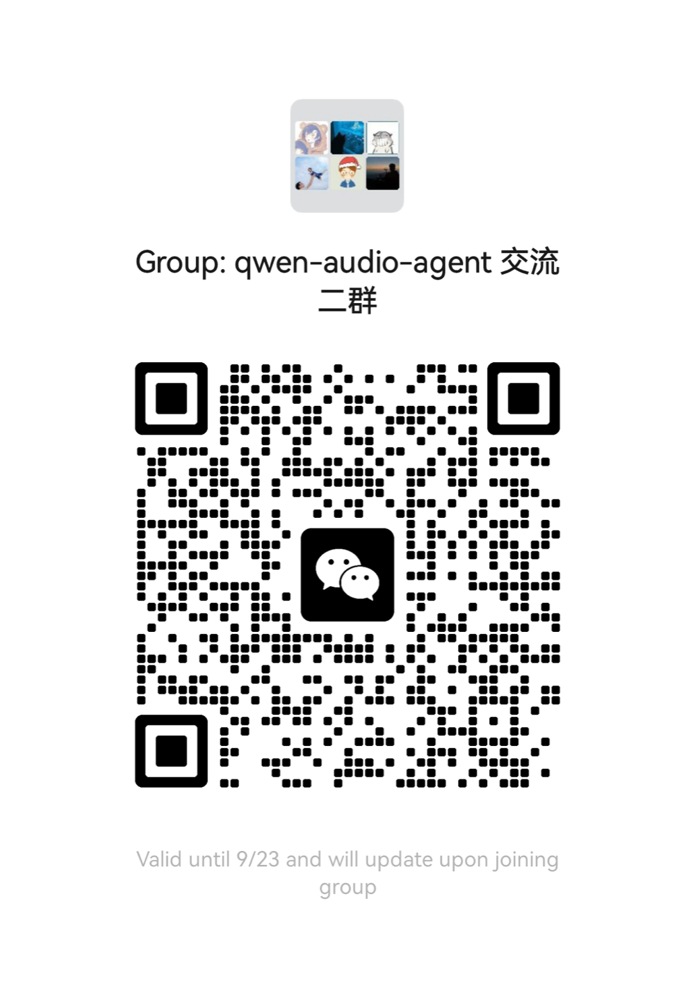

# Qwen Audio Agent

[中文](README.md) | [English](README_EN.md)

[](https://github.com/QwenAudio/qwen-audio-agent/actions/workflows/ci.yml)
[](https://www.npmjs.com/package/qwen-audio-agent)
[](https://nodejs.org/)
[](LICENSE)

## Agent Presence

Real conversation should not leave you waiting after a single sentence, nor
should it grind to a halt just because the Agent is looking something up,
calling a tool, or working on a task.

Conversation should keep flowing, and the Agent should always be present.

That is why we built **qwen-audio-agent**—a realtime voice runtime that keeps
Agents talking, working, and present. Whether chatting with you, thinking
through a problem, or working on a task, your Agent remains in the
conversation. It listens, responds, and when the task is complete, naturally
tells you:

“It’s ready.”

## News

- **v1.3.0 · In testing**
  🧪 Adds a [🤗 speech-to-speech](https://github.com/huggingface/speech-to-speech) frontend for a locally deployed VAD–STT–LLM–TTS pipeline. Available from source; the formal Release will follow after testing.
- **2026-07-30 · [v1.0.0](https://github.com/QwenAudio/qwen-audio-agent/releases/tag/v1.0.0)**
  🚀 First stable release with a macOS desktop app and integrated Gateway.
- **2026-07-28 · [v0.9.0](https://github.com/QwenAudio/qwen-audio-agent/releases/tag/v0.9.0)**
  🌍 The project became open source with a unified ACP backend architecture.

## Keep Talking While Tasks Keep Running

Conversation continues while the Agent works in the background. When the task
is done, the result returns naturally to the conversation:

https://github.com/user-attachments/assets/42022655-36d1-46b2-9c26-ff0765284000

### Core Features

- Full-duplex realtime voice interaction, natural interruption, and continuous
  multi-turn conversation
- Choose your preferred Agent with one click, reusing its existing tools, MCP
  servers, and Skills
- Foreground conversation and background tasks move forward in parallel, with
  progress checks and cancellation available at any time
- Create multiple independent tasks for asynchronous execution by backend
  Agents, with continuous status tracking
- Task results return automatically to the current conversation for follow-up
  and revision
- WebUI, terminal TUI, and a macOS desktop orb
- Local user profile and personal memory across sessions

## Reference Architecture


Questions that can be answered directly receive an immediate response. Work
that needs tools or sustained processing is delegated to a backend Agent.
Throughout the entire interaction, you are always talking to the same
assistant.

<details open>
<summary>View the detailed architecture</summary>


See the [architecture document](docs/architecture.md) for the full design and
module walkthrough.

</details>

## Agent Support

| Backend Agent | Integration | Setup | Rating |
| --- | --- | --- | --- |
| None | N/A | Frontend-only, no setup required | ★★★★★ |
| OpenCode | Native ACP | Automatic installation and Bailian setup supported | ★★★★★ |
| OpenClaw | Built-in ACP Bridge | Automatic installation and Bailian setup supported | ★★★★★ |
| Qoder | Native ACP | User installation and configuration required | ★★★★★ |
| Kimi Code | Native ACP | User installation and configuration required | ★★★★★ |
| Hermes | Native ACP | User installation and configuration required | ★★★★☆ |
| CodeBuddy | Native ACP | User installation and configuration required | ★★★★☆ |
| Codex | External ACP Adapter | User installation and configuration required | ★★★★☆ |
| Claude Code | External ACP Adapter | User installation and configuration required | ★★★★☆ |

Ratings reflect the current integration completeness, compatibility, and
extent of real-world validation. Five stars identify recommended integrations
that have been thoroughly tested; four stars identify integrations still in
development or not yet validated to the same extent. See the
[configuration guide](docs/configuration.md) for detailed setup and capability
boundaries.

## Installation

You need Node.js 22.22.2+ or 24.15.0+, npm 10+, and a
DashScope API Key when using the default DashScope realtime frontend. The
repository includes `.nvmrc` and `.node-version`; if you
use nvm, run `nvm use`.

One-line install (recommended, from npm):

```bash
npm install -g qwen-audio-agent
```

You can also install the latest code directly from GitHub:

```bash
npm install -g git+https://github.com/QwenAudio/qwen-audio-agent.git
```

Install from source:

```bash
git clone https://github.com/QwenAudio/qwen-audio-agent.git
cd qwen-audio-agent
npm install
npm run install:global
```

Upgrade to the latest npm release:

```bash
npm install -g qwen-audio-agent@latest
```

Upgrade to the latest code from GitHub:

```bash
npm install -g git+https://github.com/QwenAudio/qwen-audio-agent.git
```

## Get a DashScope API Key

Alibaba Cloud Model Studio includes Qwen Audio 3.0 Realtime in its
[free quota for new users](https://help.aliyun.com/en/model-studio/new-free-quota).
Create an API Key to start using qwen-audio-agent for free.

1. Open the Model Studio
   [API Key page](https://bailian.console.aliyun.com/?tab=model#/api-key), sign
   in, and click **Create API Key**.
2. Copy the generated Key and add it to `config.env` later. Never publish or
   commit your API Key.

See the [official API Key guide](https://help.aliyun.com/en/model-studio/get-api-key)
for details.

## Quick Start

1. Create your configuration:

```bash
qwenaudio config
```

2. Open the displayed `config.env` file and add your DashScope API Key. Select
   OpenClaw or another backend Agent only when you need background tasks:

```dotenv
DASHSCOPE_API_KEY=your-key
# Voice model: qwen-audio-3.0-realtime-flash or qwen-audio-3.0-realtime-plus (default)
QWEN_AUDIO_REALTIME_MODEL=qwen-audio-3.0-realtime-plus
# Optional; uncomment when background tasks are needed
# AGENT_PROTOCOL=openclaw
# Backend model: can be left empty; the Agent uses its own user configuration
# QWEN_AUDIO_AGENT_BACKEND_MODEL=qwen3.7-max
```

3. Start the Gateway in one terminal:

```bash
qwenaudio
```

4. Open another terminal and start the TUI:

```bash
qwenaudio tui
```

You can use the browser interface instead:

```bash
qwenaudio webui
```

### Use a Hugging Face speech-to-speech frontend

> [!NOTE]
> This feature is planned for v1.3.0. It is currently available from source and remains under testing; it is not yet included in a stable Release.

qwen-audio-agent can also connect to a user-managed
[Hugging Face speech-to-speech](https://github.com/huggingface/speech-to-speech)
server. It combines VAD, STT, LLM, and TTS behind an OpenAI Realtime-compatible
API. The entire voice pipeline can run locally, or you can replace individual
models and services as needed.

1. Install speech-to-speech:

```bash
pip install "speech-to-speech[paraformer]"
```

2. Start a fully local service:

Linux / Windows with an NVIDIA GPU:

```bash
speech-to-speech \
  --stt paraformer \
  --llm_backend transformers \
  --device cuda
```

Apple Silicon:

```bash
speech-to-speech \
  --stt paraformer \
  --llm_backend mlx-lm \
  --device mps
```

Without an NVIDIA GPU, you can choose a smaller local model suitable for CPU
inference, or point the LLM backend at a local vLLM / llama.cpp server. The service listens on
`ws://127.0.0.1:8765/v1/realtime` by default.

3. Add the following to the qwen-audio-agent `config.env` file:

```dotenv
QWEN_AUDIO_REALTIME_PROVIDER=speech-to-speech
SPEECH_TO_SPEECH_REALTIME_URL=ws://127.0.0.1:8765/v1/realtime
```

Then start `qwenaudio` as usual. Fully local mode requires no cloud API Key. The
Gateway only connects to the Realtime endpoint and does not alter the STT, LLM,
TTS, or voice configured in speech-to-speech. Set
`SPEECH_TO_SPEECH_AUTH_TOKEN` only when the Realtime endpoint is behind a proxy
that requires Bearer authentication.

### TUI Notes

| Platform | Default mode | How to interrupt |
| --- | --- | --- |
| macOS | Full duplex with echo cancellation | Start speaking |
| Linux / Windows | Half duplex | Press `x` during playback |

Before first use on Linux or Windows, install `sounddevice` and ensure system
PortAudio is available. You can also enable full-duplex mode without echo
cancellation. Wear headphones in this mode to avoid speaker output causing
false transcription:

```bash
qwenaudio tui --audio-mode full
```

## macOS Desktop App

The desktop app provides a persistent voice orb and embeds and manages its own
Gateway, so no service needs to be started in advance. On first launch, the app
creates its configuration file and guides you to enter a DashScope API Key and
choose a backend Agent (or frontend-only mode) in Settings.

The desktop app includes a streaming wave orb and a liquid gradient orb. Their
original animated thinking / breathing states are shown below:

| Streaming Wave Orb | Liquid Gradient Orb |
| --- | --- |
|  |  |

Download the `.dmg` from the releases page, open it, and drag
**Qwen Audio Agent** into Applications.

Build a local test package from source:

```bash
npm run desktop:build:local
```

## Run the Gateway in the Background

To keep your personal assistant available, install the Gateway as a user
service:

```bash
qwenaudio gateway install
```

Common management commands:

```bash
qwenaudio gateway status
qwenaudio gateway restart
qwenaudio gateway stop
qwenaudio gateway start
qwenaudio gateway uninstall
```

## Choose a Backend Agent

`AGENT_PROTOCOL` is optional. When it is empty, the Gateway runs in
frontend-only mode and realtime voice chat remains available. If a request
requires background execution, the frontend clearly explains that no backend
Agent is available. You can also run `qwenaudio --backend none` to explicitly
start in frontend-only mode.

Select the backend Agent with `AGENT_PROTOCOL` or `--backend`. After selecting
one, OpenCode and OpenClaw can be downloaded automatically. Configure
`DASHSCOPE_API_KEY` and
`QWEN_AUDIO_AGENT_BACKEND_MODEL` to connect them to a Bailian model
automatically. When no backend model is specified and the Agent is already
installed and configured, qwen-audio-agent fully reuses the user's existing
environment.

Check which backends are available:

```bash
qwenaudio setup
```

Use OpenClaw:

```dotenv
AGENT_PROTOCOL=openclaw
```

Use OpenCode:

```dotenv
AGENT_PROTOCOL=opencode
```

Use Qoder:

```dotenv
AGENT_PROTOCOL=qoder
```

Backend Agents require the user to install and configure the native Agent
first. qwen-audio-agent reuses its user-level model, tools, MCP servers,
Skills, and authentication.

Some Agents connect through external ACP adapters. Besides the Agent itself,
install the matching adapter globally. For example, for Codex:

```bash
npm install -g @agentclientprotocol/codex-acp
```

The CLI falls back to starting a missing adapter on demand with npx; the
desktop app only uses installed components for reliable startup, so install
the adapter up front.

Use another Agent that supports ACP over stdio:

```dotenv
AGENT_PROTOCOL=acp
ACP_COMMAND=your-agent
ACP_ARGS=["--acp"]
```

The generic ACP entry point requires no Gateway code changes. Configure its command, arguments, display label, and workspace with `ACP_COMMAND`, `ACP_ARGS`, `ACP_LABEL`, and `ACP_WORKSPACE`.

Backend permissions default to `native`, so the backend Agent asks when
permission is required. Enable the following option only in trusted projects
and only if you explicitly accept automatic command execution and file
changes:

```dotenv
QWEN_AUDIO_AGENT_BACKEND_PERMISSION_MODE=full
```

See the [configuration guide](docs/configuration.md) for all options.

## User Profile and Memory

User data is stored in `~/.config/qwaudio/`:

- `USER.md`: your preferred name, location, preferences, and frequently used
  projects
- `frontend-memory.json`: information you explicitly ask the assistant to
  remember long term
- `tasks.json`: task results and pending notification state

These files remain on your computer and are never written to the source
repository. You can edit `USER.md` directly or ask the assistant to remember or
forget information during a conversation.

## Usage Notes

- Do not store passwords, API Keys, verification codes, or access tokens in
  your user profile or conversations.
- Microphone audio and realtime conversations are sent to the configured
  Realtime frontend (DashScope or speech-to-speech).
- Backend tasks may call models, tools, MCP servers, and external services
  configured for the selected Agent.
- `full` permission allows command execution and file changes. Use it only in
  trusted projects.
- The Gateway is local-only by default. Do not expose it directly to a LAN or
  the public internet.
- Wear headphones when using full duplex without echo cancellation on Linux or
  Windows.

See the [privacy notice](PRIVACY.md) for data boundaries and the
[configuration guide](docs/configuration.md) for network and permission
settings.

## Development

```bash
npm install
npm run build
npm test
```

```bash
npm run dev       # Gateway and WebUI with hot reload
npm run desktop   # macOS desktop orb
```

See [CONTRIBUTING.md](CONTRIBUTING.md) for more about building, testing, and
releasing.

## Discussion & Sharing

You can start a discussion directly in
[GitHub Issues](https://github.com/QwenAudio/qwen-audio-agent/issues).

For users in China, you can also scan the QR code on the left to join our
WeChat group. If the group code is full or expired, scan either maintainer's
personal QR code on the right and they will invite you to the group.

| WeChat Group | Personal WeChat | Personal WeChat |
| :---: | :---: | :---: |
|  |  |  |

## Contributing and Security

- Development and contribution guide: [CONTRIBUTING.md](CONTRIBUTING.md)
- Security reports: [SECURITY.md](SECURITY.md)
- Data flow and privacy: [PRIVACY.md](PRIVACY.md)
- Third-party notices: [THIRD_PARTY_NOTICES.md](THIRD_PARTY_NOTICES.md)

## License

[Apache License 2.0](LICENSE)
