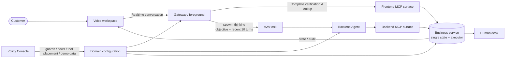

# Customer Service Voice Agent Example

[English](README.md) | [中文](README_ZH.md)

A runnable retail / airline customer service demo. The voice frontend handles conversation,
identity verification and lookups, and delegates business operations to a backend agent over A2A.
Both agents access a single business state through two MCP tool surfaces. The service validates
eligibility, amounts, inventory and approval rather than relying on the model to calculate or remember rules.

This is a local, single-call demo—not a production support system or a complete official τ-bench implementation.

## What This Example Shows

- **Low-latency foreground:** Realtime handles identity verification and complete read-only
  queries directly instead of paying an extra backend round trip.
- **Delegated business work:** writes, money movement, irreversible actions and composed tasks
  go through `spawn_thinking` to a replaceable backend Agent over A2A.
- **Reliable handoff:** every delegated task receives up to ten recent customer/assistant turns;
  the objective separately carries verified IDs and frontend lookup results that are not present
  in the dialogue transcript.
- **One source of business truth:** foreground and backend MCP surfaces share the same executor,
  database, policy guards and approval lifecycle.
- **Administrable policy:** the Policy Console extracts policy candidates for human review and
  applies decision tables, flow guidance, tool placement and demo-data changes with diff, backup
  and audit support.

## Demo

**From conversation to resolution: voice-driven order cancellation.** The recording shows
identity verification with a spoken correction, order lookup, a cancellation/refund preview,
and the result after the customer's confirmation.

https://github.com/user-attachments/assets/ddb4cc30-e02c-4b3c-ba2a-63b3933cdaed

## Example Scope

An opt-in [τ-bench scenario API](benchmark/README.md) loads official policies, full databases and
Python tools from a trusted local checkout. Text runners connect the official user simulator
and evaluator to the backend-only chain or the real Realtime/Gateway/A2A/MCP harness.
ASR/TTS and physical voice frontend evaluation are not covered.

The backend Agent keeps up to 50 completed task request/reply turns in memory (at most
49 previous turns plus the current request). The Gateway reuses the server-issued A2A
Context for later Tasks from the same customer. Approval previews stay attached to their
pending Task and are never replayed as reusable authorization. Resetting the business
session, switching customers, or restarting the Agent starts fresh backend history.

## Capabilities

| Area | Implemented |
|---|---|
| Retail | Email or name + ZIP verification, orders, product options/inventory, cancellation, full/partial returns, shipping address changes |
| Airline | Membership ID or name + ID suffix verification, reservations/flight status, flight search, cancellation, flight/cabin changes, checked bags, policy-based compensation |
| Business boundaries | Private lookup verification, eligibility/time windows, authority ceilings, human escalation for policy gaps |
| Confirmation | Preview before writes; commit saved operations after explicit consent; revoke approvals on decline, cancellation or timeout |
| Customer workspace | Voice calls, conversation history, identity, orders/reservations, tool audit, reset/new customer |
| Human desk | Transferred customer state and handoff context |
| Policy console | Extraction/review, decision tables, flows/tool surfaces, coverage checks, database editing, diffs, backups and audit |

Retail exchanges are not implemented. Human escalation is demo state handoff, not an external contact-center integration.

## Quick Start

Run from the repository root. Check the root `package.json` for supported Node.js versions.

```bash
npm install
npm run example:customer-service:install
```

Create `examples/customer-service/.env.local` using [.env.example](.env.example) as a reference.
Do not overwrite existing configuration. At minimum:

```dotenv
DASHSCOPE_API_KEY=your_dashscope_api_key
DASHSCOPE_MODEL=qwen3.8-flash
QWEN_AUDIO_REALTIME_MODEL=qwen-audio-3.0-realtime-plus
QWEN_AUDIO_REALTIME_VOICE=longanqian
```

The backend uses DashScope Chat Completions; the voice frontend uses a separate Realtime WebSocket API.
Your key needs access to the corresponding models. Set `QWEN_AUDIO_REALTIME_BASE_URL` for a custom voice endpoint.
The example loads its own and the repository-root `.env.local`: process variables take precedence,
then example-local values, then root-local values.

```bash
npm run example:customer-service           # Retail: five processes
npm run example:customer-service:airline   # Airline: five processes
npm run example:customer-service:both      # Both groups: ten processes
```

| UI / service | Retail | Airline |
|---|---|---|
| Customer workspace (start here) | http://127.0.0.1:4620 | http://127.0.0.1:4720 |
| Human desk | http://127.0.0.1:4630 | http://127.0.0.1:4730 |
| Gateway built-in UI | http://127.0.0.1:18889 | http://127.0.0.1:18989 |
| Business service | http://127.0.0.1:3110 | http://127.0.0.1:3210 |
| A2A agent | http://127.0.0.1:3120 | http://127.0.0.1:3220 |

Grant microphone permission. Do not control the same call through both the workspace and Gateway UI.
Workspace HTTP/WebSocket requests use its same-origin proxy rather than direct cross-port Gateway requests.

Start the independent policy console separately:

```bash
npm run example:customer-service:console   # http://127.0.0.1:4610
```

Ctrl+C stops the bootstrap process group. Business data is in memory; restarting does not restore order mutations.

## Suggested Demo

Use the workspace reset or new-customer button before each independent scenario.

### Retail

1. Verify with `liming3021@example.com`, then ask for orders.
2. Request cancellation of `#W1082334`; listen to the item, refund and payment-method preview.
3. Decline: the order must remain pending. Request again and explicitly accept: only then should it change.
4. Try the alternative verification method: name `陈静` and ZIP `510620`, for a customer without email.

Other boundaries: `#W3301887` exceeds the authority ceiling; furniture order `#W3376900`
has no policy-defined return window. Verify each order's owner first; inspect demo data in the console.
The assistant should explain the boundary and escalate, not invent a rule.

### Airline

1. Verify with membership ID `CY10023841` and inspect reservation `CYR8801`.
2. Search the same route and request a change from `CY1201` to `CY1203`.
3. Review fees and fare difference; explicitly accept, then check reservation, seats and payment records.
4. Declining must leave the booking unchanged; flown/ineligible bookings should be refused by the service.

Flight dates shift relative to the demo anchor. Use lookup results rather than hard-coded calendar dates.

## Architecture



The frontend surface is a subset of the backend surface: verification, read-only lookups and
`transfer_to_human`. Approval-requiring writes remain backend-only. Both use the same executor and state.
On each `spawn_thinking`, the Gateway also snapshots up to ten recent customer turns and their
assistant replies for the new A2A task. This dialogue is context, not an authoritative tool log:
frontend function-call arguments/results are not included. The objective must still carry key
identifiers and findings, and the backend must re-check current business state before writes.

The frontend retrieves the current domain's `policy.md` through knowledge retrieval.
Public web search and user-profile memory are disabled.
`guards.json` decision tables enforce most eligibility, authority and monetary rules.
`flows.json` guides ordering through the backend prompt; it is not an enforced workflow engine.

### Default foreground/backend boundary

| Route | Used when | Typical tools |
|---|---|---|
| Foreground Realtime | The visible tools can completely answer the request without protected business mutation | identity verification, orders/reservations, inventory, flight search/status |
| Backend Agent | The customer goal changes business state, moves money, needs approval, is irreversible, or requires a composed investigation | cancellation/refund, return, address change, rebooking, cabin/seat/baggage changes, compensation |
| Human handoff | Policy is missing, authority is exceeded, or the customer explicitly asks for a person | `transfer_to_human` (kept in the foreground to avoid an unnecessary A2A round trip) |

The Policy Console can override placement, but moving a protected write to the foreground is
reported as a risk because the foreground has no suspended `auth_required` lifecycle.

## Evaluation Results

The public adapted EVA Airline comparison contains all 50 Airline records from EVA-Bench-mix,
run through a tau2-style conversation and terminal-state scoring protocol. It compares the
Realtime frontend, the complete customer-service harness, and the text backend model under the
same task content.

| Tested path | Passed tasks | Task completion |
|---|---:|---:|
| Realtime API only | 22 / 50 | **44%** |
| Realtime API + customer-service Harness + Qwen3.8-Max backend | 31 / 50 | **62%** |
| Qwen3.8-Max only | 34 / 50 | **68%** |

The simulator and assertion judge were GPT-5.6-Luna for every path. Each task used an isolated
database, the complete EVA Airline policy and the original EVA function schemas. Input/output
was text, so these numbers do not measure ASR, TTS, interruption or physical audio quality.
Provider/transport timeouts were rerun only to obtain a normally completed trial; completed
zero-reward tasks were not retried. This is a system comparison, not an official EVA or tau2
leaderboard result. See the [result provenance and reproduction command](benchmark/EVA_AIRLINE_RESULTS.md)
and the complete [benchmark guide](benchmark/README.md).

### Approval Is Not a Model-Supplied Boolean

1. The first write-tool call creates a preview and internal `data.approval = { token, preview }`, without mutating the DB.
2. The executor saves the tool, original arguments, token and task context, then emits `auth_required`.
3. Customers receive readable previews; tokens and internal tool instructions stay out of A2A confirmation text and model messages.
4. The frontend responds through `respond_agent_input`. The A2A adapter carries
   `qwenAudioInputResponse = { kind: 'authorization', action }` in message metadata.
5. Authorization requires explicit `accept`, `decline` or `cancel`; absent/invalid actions are rejected.
   Only accept commits the saved operation. Decline, cancellation and timeout clear pending state and revoke the token.
6. The model receives the committed result and continues the original task. Each subsequent write requires its own approval.
   Final output excludes historical progress and earlier confirmation questions.

Approvals are keyed by taskId, expire after five minutes, are single-use, and bind an action and subject.
Flight/cabin changes additionally bind target, original booking state and quote; drift is rejected.
Tokens do not replace accurate consent recognition: the voice frontend must still interpret the customer's answer correctly.
The local A2A service lacks production authentication; do not expose it publicly.

### Reset and New Customer

The workspace stops audio and closes the old connection before coordinating `POST /api/customer-service/reset`:

- Cancel the old conversation's Gateway tasks.
- Clear backend pending operations, revoke approvals and wait for running executions to exit.
- Reset the business database and verification state.
- Reconnect with a new conversation ID, excluding old history from the new context.

The new conversation ID is stored in the current tab's sessionStorage for refresh/reconnect;
the MCP business sessionId remains fixed. Old history files are retained, not deleted.
Cleanup failures pause calls and prompt a retry rather than pretending the switch succeeded.
Direct service `reset` / `new-customer` calls only reset business data, without cross-process cleanup.

## Policy Console

Administrators can edit decision tables, flows, frontend/backend tool assignment and demo data.
Extraction runs three times; disagreements support human review instead of relying on model-reported confidence.
Gaps, conflicts and candidates without a matching policy citation require review.

“Preview and apply” validates configuration, shows diffs and coverage, then writes domain files.
Changes are backed up under `.runtime-console/backups/` and audited; partial write failures roll back.

| Change | Takes effect |
|---|---|
| Decision tables / guards | Next tool call |
| Flows | Next backend task |
| Gateway tool surface | Restart that domain's Gateway |
| Demo database | Reset the business session or restart the service |

## Tests and Evaluation

```bash
npm run test:customer-service             # Installs example dependencies, then tests all components
npm run test:customer-service:smoke       # Core in-memory regressions; no model key or local ports
npm run example:customer-service:lint
node --test server/test/a2a*.test.mjs     # Framework A2A adapter regression
```

Tests cover verification, surfaces, decision tables, writes, MCP/A2A approvals, cancellation/timeout,
per-operation approval in multi-step tasks, reset coordination, voice-client controls, configuration application
and output-audit functions. Integration tests use stub models and temporary local ports, not paid API calls.
Passing tests is not proof that real voice works end to end.

The tools and retail data borrow τ-bench structure, but this example uses trimmed/localized data and policies.
The default demo does not use the official simulator/scorer; optional adapters and runners are documented
in benchmark/README.md. Stub-model regression success rates are not official scores.
Formal evaluation must pin a benchmark version, align environments, and cover frontend verification, delegation,
approval and task continuation—not just the backend model.

## Known Limitations

- One call per domain: frontend/backend MCP still use process-fixed `CS_SESSION_ID`.
  New conversation IDs prevent old conversational context from entering the next customer, not concurrent business-state isolation.
- Business data, tasks and approvals are primarily in memory; restart recovery, durable transactions and idempotency are incomplete.
- Real voice recognition, consent interpretation, tool selection and phrasing need real-voice regression and simulated-user evaluation.
- Retail exchanges and the complete official τ-bench tool/task set are not covered.
- Output-audit functions and an HTTP endpoint exist, but are not automatically wired into live voice output or used as a pre-playback blocker.
- Workspace, agent, business API and console are local development services with administrative/reset capabilities, not production access control.

## Directory Guide

```text
bootstrap/     Environment loading and per-domain process groups
client/        Workspace, same-origin proxy, customer reset coordination, audio
desk/          Human desk
gateway/       A2A composition, assistant profiles, frontend surfaces, policy retrieval
agent/         Model, backend MCP client, task and approval lifecycle
service/       In-memory state, HTTP/SSE/MCP, business tools, output auditing
console/       Policy extraction/review, configuration and database editor
domains/       retail/airline policy, guards, flows and demo databases
```
